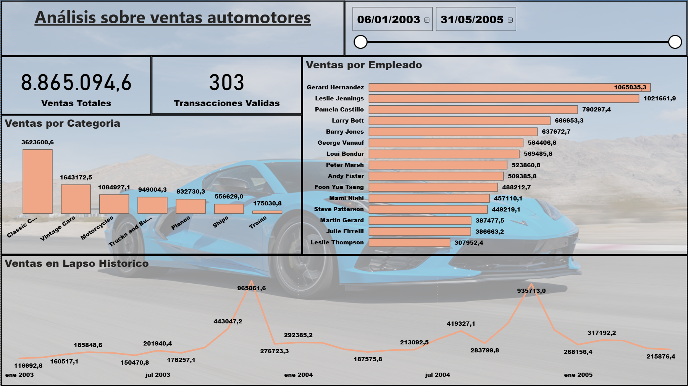

# Proyecto BI: Análisis de Ventas Automotores – ClassicModels Ltda.

## Ingesta automatizada desde Kaggle con Api y Duckdb - ingest_classicmodels.py

Este script se encarga de la automatización de la descarga del dataset ClassicModels desde Kaggle mediante su API oficial. El flujo incluye la autenticación, la descarga y la descompresión de los archivos directamente en el directorio del proyecto, garantizando reproducibilidad y eliminando pasos manuales. Además, al preparar los datos en un entorno compatible con DuckDB, se habilita la posibilidad de realizar consultas SQL rápidas sobre los archivos locales sin necesidad de cargarlos completamente en memoria, lo que facilita tareas de exploración y pruebas durante las etapas iniciales del pipeline.

## Transformación relacional con SQL sobre SQLite - transform_classicmodels.py

En esta etapa se aprovecha que el dataset descargado desde Kaggle ya incluye una base en formato SQLite, lo que permite realizar consultas directamente sobre su modelo relacional. Mediante SQL se consolidan las tablas clave (orders, orderdetails, products, customers y employees) en una única vista enriquecida con información de facturas, fechas, productos, clientes y vendedores. El resultado se procesa con pandas y se exporta como classicmodels_join.csv, que funciona como un dataset limpio y listo para la visualización en herramientas de análisis como Power BI. Esta aproximación documenta claramente las relaciones entre entidades y facilita la generación de insights a partir de los datos.

## Motivación del uso de herramientas
Usé ambos motores de base de datos porque cada uno aporta ventajas en etapas distintas del pipeline.

DuckDB se integró en la fase de ingesta y exploración rápida, ya que permite consultar directamente archivos locales (CSV o Parquet) sin necesidad de cargarlos en memoria ni montar un servidor. Esto lo convierte en una herramienta muy útil para validar la descarga del dataset y realizar pruebas iniciales con un entorno liviano y portable.

SQLite, en cambio, fue clave en la fase de transformación relacional, porque el dataset de Kaggle ya venía estructurado en formato .sqlite. Esto me permitió aprovechar el modelo relacional existente para realizar un JOIN complejo entre varias tablas, manteniendo integridad y documentando claramente las relaciones antes de generar el dataset consolidado final

## Contexto y Alcance del proyecto BI
Caso ficticio: ClassicModels Ltda. desea instaurar una cultura de datos para tomar decisiones objetivas y mejorar la atención al cliente. Para ello, se ha contratado el desarrollo de un informe de Business Intelligence en Power BI que responda a las siguientes preguntas de negocio:

1. ¿Cuántas transacciones válidas se han realizado de forma histórica?  
2. ¿Cuál es el monto total de las ventas históricas?  
3. ¿Cuál es el monto de las ventas por categoría de productos?  
4. ¿Cómo se distribuye el monto de ventas a lo largo del tiempo?  
5. ¿Cuál es el monto de ventas por vendedor?  

En este repositorio encontrarás:

- **Conexión y modelado** de datos en Power Query  
- **Cálculos DAX** para métricas clave  
- **Visualizaciones**: tarjetas, columnas, barras, líneas y segmentador de fechas  
- **Análisis de resultados** y **recomendaciones**  

---

## Dashboard - classicmodels.pbix

 
## Resumen de KPIs Clave

1. **Transacciones válidas (Shipped)**  
   - **303** transacciones  

2. **Ventas totales históricas**  
   - **8.865.094,6**  

3. **Ventas por categoría**  
   | Categoría          | Monto       |
   |--------------------|------------:|
   | Classic Cars       | 3.623.600,6 |
   | Vintage Cars       | 1.643.172,5 |
   | Motorcycles        | 1.084.927,1 |
   | Trucks and Buses   |   949.004,3 |
   | Planes             |   832.730,3 |
   | Ships              |   556.629,0 |
   | Trains             |   175.030,8 |

4. **Distribución de ventas en el tiempo**  
   - **Pico máximo**: ene-2004 → 965.061,6  
   - **Segundo pico**: ene-2005 → 935.713,0  
   - **Valor mínimo**: jul-2003 → 150.470,8  
   - Tendencia general: sube hacia enero de cada año y cae en el período mar-may.

- Las ventas crecieron un 18% interanual.
- La región norte mostró mayor rentabilidad por unidad vendida.
- El 80% de las ventas provienen del 20% de los productos (ley de Pareto).

## Archivos
- `ingest_classicmodels.py`: Script py de ingesta.
- `classic.db`: Base de datos de classicmodels creada por dicho script
- `transform_classicmodels.py`: Script de transformación con join sobre sqlite para exportar a .csv y usar como fuente de datos para power bi.
- `classicmodels_join.csv`
- `classicmodels.pbix`: Archivo de Power BI con dashboard correspondiente.
- `classicmodels.png`: Screenshot del dashboard para mostrar en el readme.
- `Readme.md`: Documentación completa del proyecto.